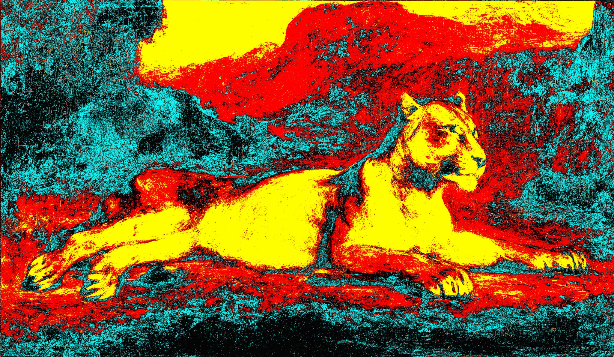
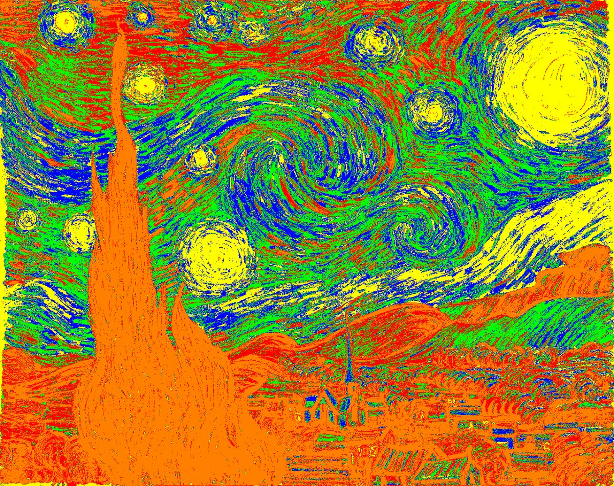
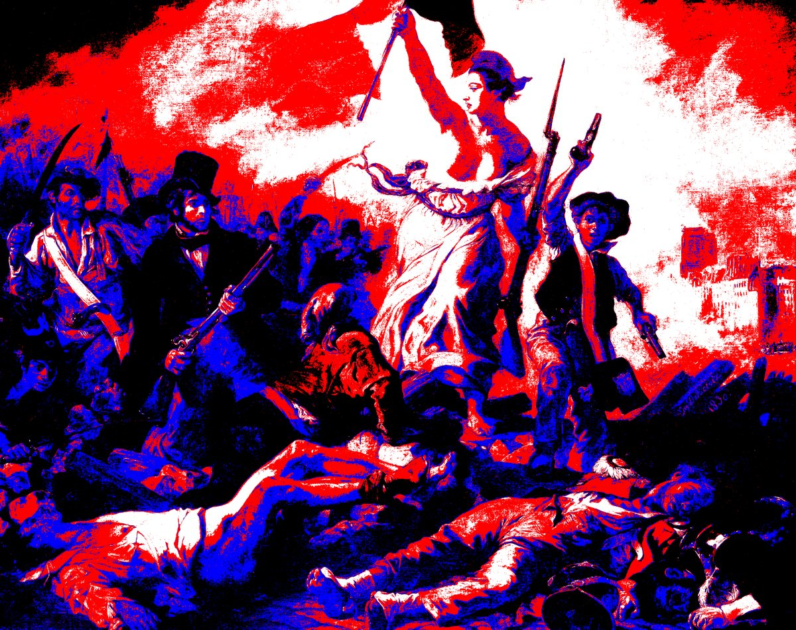
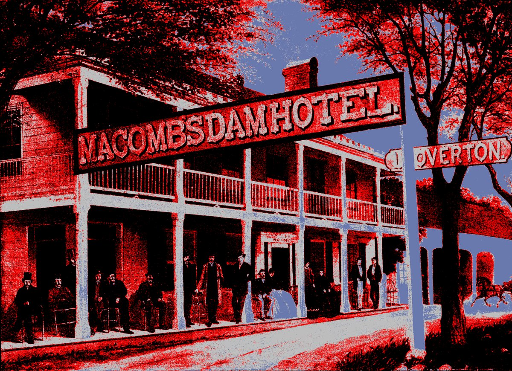

# The Painter Goblin

Paints from a basement near you. Hates the outdoors, loves art. [Gallery](http://twitter.com/paintergoblin).

## Intro

Painter Goblin Twitter Bot. Inspired by a [Zine](https://github.com/ross-spencer/painter-goblin/tree/master/goblin-zine/pages) I created in 2015. The zine in turn was inspired by a Reddit user comment. I thought it cool so figured I'd give it a whirl.

## Wikidata

Paints new images from Wikidata. The algorithm is simple. Enhance contrast, enhance brightness. This makes muddy images less blurry. Enhance contrast and then convert to paletted image and swap in a randomized curated palette from the collection.

He enjoys his work, I hope you do!

## Samples

**Lioness Reclining**, Eugène Delacroix, Minneapolis Institute of Art:

**Die Sterrenag**, Vincent van Gogh, Museum of Modern Art:

**Liberty Leading the People**, Eugène Delacroix, French paintings, room 77:

**Macomb's Dam Hotel**, M. A. Sullivan, Metropolitan Museum of Art:

## Apps

* Paintergoblin.py - creates the images, can be run standalone
* Wikigoblin.py - retrieves data to tweet from the Wikidata SPARQL services
* Twittergoblin.py - Tweets for us! Either a random Wikidata image or from am existing Wikidata link

## Image Categories

Categories of Image:

* imgprint = "Q11060274"
* imgdrawing = "Q93184"
* imgphoto = "Q125191"
* imgwatercolor = "Q18761202"
* imgpainting = "Q3305213"
* imgwoodcutprint = "Q18219090"
* imgpastel = "Q12043905"
* imgposter = "Q429785"
* imgnone = None

**Counts as of July 2017**

	3756 Prints
	1044 Drawings
	2614 Photos, 49 not from NatLib Wales or Scotland
    1250 Watercolors
    60501 Paintings
    44 Woodcut Prints
    320 Pastels
    38 Posters

**Example count in SPARQL:**

    SELECT (COUNT (DISTINCT ?item) as ?count) WHERE {
        ?item wdt:P31 wd:Q429785.
        ?item wdt:P18 ?image.
        OPTIONAL { ?item wdt:P276 ?loc . }
        ?item wdt:P195 ?coll .
        ?item wdt:P170 ?artist .
        SERVICE wikibase:label { bd:serviceParam wikibase:language "en,fr,de,it"}
    }

## Gallery

Gallery code is provided by [Andy Zhang](https://github.com/andyzg/gallery)
please support their work. It has made it incredibly easy for me to provide
some level of gallery support for the Painter Goblin's work.

* To install: `bundle install`
* To run: `bundle exec jekyll serve`

## License

GPL v3.0
